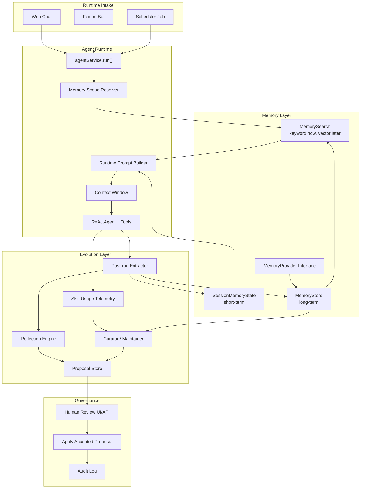
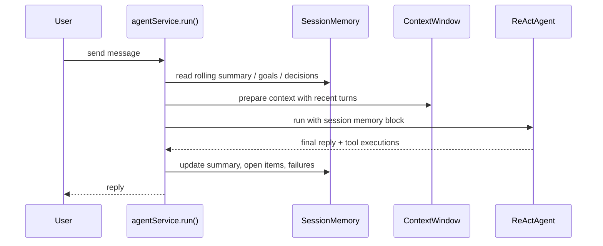
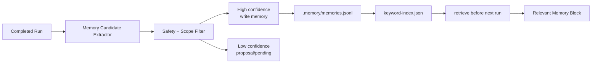
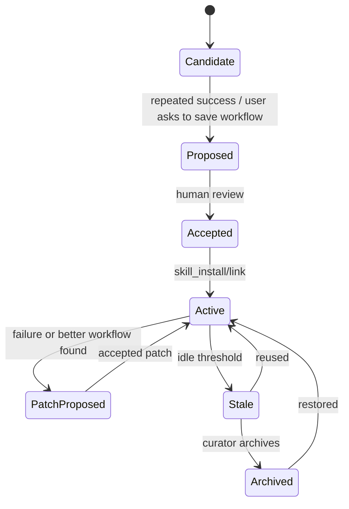
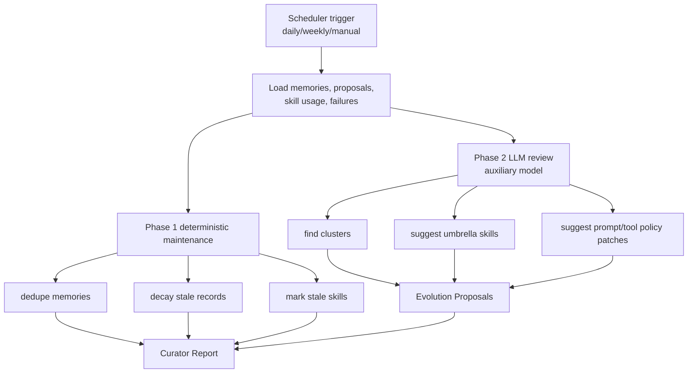
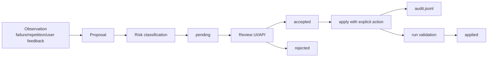
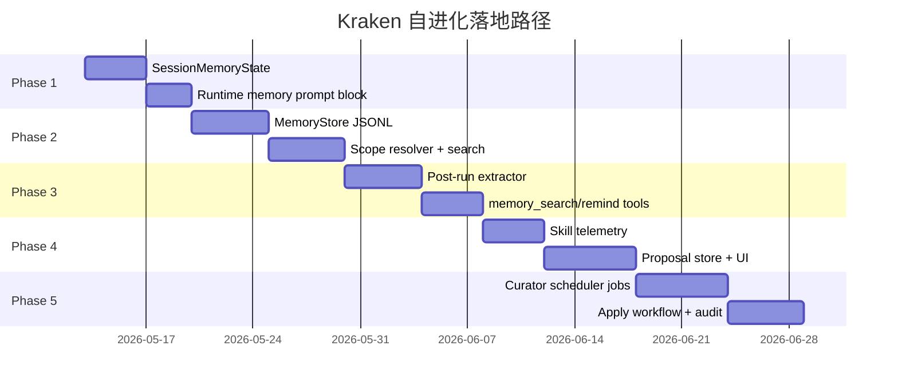
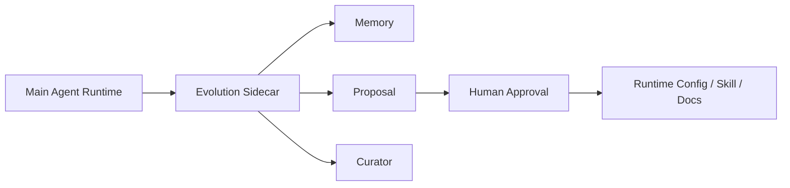

# Kraken Self-Improving / 自进化系统方案

## 1. 目标

这份方案描述如何把 `kraken-server` 做成一个贴近 Hermes Agent 架构的 self-improving agent：它不通过微调模型变聪明，而是通过运行中的反馈闭环持续沉淀记忆、改进技能、整理失败经验，并把高风险改动变成可审计 proposal。

现有的 [`memory-evolution-system.md`](./memory-evolution-system.md) 已经定义了记忆与提案的基础模型；本文补充更贴近 Hermes Agent 的运行架构、模块边界和实施路径。

核心原则：

- 对话内适应：当前 session 能稳定延续目标、决策、失败和 open items。
- 跨会话记忆：不同入口、不同 session 能复用同一 workspace 或 Feishu scope 的经验。
- 技能进化：把重复成功的流程升维成 skill，把失败修复沉淀成 skill patch proposal。
- 后台策展：用 scheduler 定期去重、归档、合并、生成 digest。
- 治理优先：默认不允许 agent 静默改 prompt、skill、代码、权限。

## 2. Hermes 启发点

Hermes Agent 的自进化可以拆成四个可借鉴机制：

| Hermes 机制 | Kraken 对应实现 |
| --- | --- |
| In-conversation adaptation | `context-window.ts` + `SessionMemoryState` |
| Cross-session memory | `src/memory/*` + `.memory/memories.jsonl` |
| Skill self-improvement | `skill_install` / `skill` + skill usage telemetry + skill proposal |
| Curator | `src/evolution/curator.ts` + scheduler maintenance jobs |

Kraken 不建议第一阶段照搬 Hermes 的“自动改技能”能力。Kraken 已经有 shell、file write、skill install、Feishu 等高影响工具，自动修改行为面太大。推荐先做 proposal-only 自进化：Agent 可以观察、总结、建议、生成 patch 草案，但应用必须由人确认。

## 3. 总体架构



## 4. 三层进化循环

### 4.1 第一层：对话内适应

目标是让当前任务不中断、不遗忘，不依赖模型在长上下文里自己“记住一切”。



建议新增到 `SessionRecord`：

```ts
interface SessionMemoryState {
  summary: string
  goals: string[]
  decisions: string[]
  openItems: string[]
  userPreferences: string[]
  relevantFiles: string[]
  recentFailures: Array<{
    toolName: string
    inputPreview: string
    error: string
    resolved?: boolean
  }>
  updatedAt: string
}
```

实现位置：

- `src/runtime/session-store.ts`: 持久化 `memory`
- `src/memory/short-term.ts`: 更新 rolling summary
- `src/memory/prompt.ts`: 渲染 `## Session Memory`
- `src/runtime/agent-service.ts`: 在 runtime prompt 中注入

第一阶段可以用 deterministic extractor，不必每轮都调用 LLM：

- 用户消息和最终回复提取 title/open items
- tool error 写入 `recentFailures`
- `context-window.ts` 的压缩摘要进入 `summary`

### 4.2 第二层：跨会话知识沉淀

长期记忆解决“这个项目/用户/Feishu 群/定时任务以前学到过什么”。



推荐第一阶段目录：

```text
.memory/
├── memories.jsonl
├── reflections.jsonl
├── proposals.jsonl
├── audit.jsonl
├── indexes/
│   └── keyword-index.json
└── runs/
    └── <runId>.json
```

`MemoryProvider` 参考 Hermes 的可插拔模型，但先只实现本地 provider：

```ts
interface MemoryProvider {
  initialize(input: { memoryDir: string }): Promise<void>
  prefetch(input: MemoryQuery): Promise<MemoryRecord[]>
  syncTurn(input: CompletedTurn): Promise<MemoryCandidate[]>
  onSessionEnd(input: SessionRecord): Promise<void>
  onMemoryWrite(record: MemoryRecord): Promise<void>
}
```

默认 scope 规则：

| 入口 | Scope |
| --- | --- |
| Web + workspaceRoot | `workspace:<root>` |
| Web without workspace | `global`，但默认不自动写 |
| Feishu p2p | `feishu:p2p:<chatId>` + optional `user:<senderId>` |
| Feishu group | `feishu:group:<chatId>` |
| Scheduler | `scheduler-job:<jobId>` + workspace |
| Skill | `skill:<name>`，只放流程知识 |

### 4.3 第三层：技能进化

Kraken 已有 skill system，适合承载“流程级长期记忆”。但技能比 memory 更强，因为它会直接影响未来行为，所以必须更严格。



建议给 skill 增加使用遥测文件：

```text
<skill-dir>/.kraken-usage.json
```

```ts
interface SkillUsageRecord {
  name: string
  origin: 'bundled' | 'local' | 'installed' | 'agent_proposed'
  useCount: number
  viewCount: number
  patchProposalCount: number
  lastUsedAt?: string
  lastViewedAt?: string
  state: 'active' | 'stale' | 'archived'
  pinned: boolean
}
```

采集点：

- `src/tools/skill.ts`
  - `activate`: `viewCount += 1`
  - `read_reference`: `viewCount += 1`
- `src/tools/skill-install.ts`
  - install/link/init/validate 记录来源
- `src/memory/extractor.ts`
  - 当某个 workflow 重复成功，生成 `skill_create` proposal
  - 当某个 skill 关联失败，生成 `skill_patch` proposal

## 5. Curator 后台策展人

Curator 是 Hermes 架构里最值得借鉴的部分。Kraken 版本应先做“整理与建议”，不要自动修改。



Curator 输入：

- `.memory/memories.jsonl`
- `.memory/reflections.jsonl`
- `.memory/proposals.jsonl`
- skill usage telemetry
- scheduler execution failures
- `logs/model.jsonl` 的 request/response/error 摘要

Curator 输出：

- `.memory/curator/<timestamp>/REPORT.md`
- `.memory/curator/<timestamp>/run.json`
- 新增或更新 `EvolutionProposal`

Curator 必须禁用递归自进化：

- 不加载长期记忆
- 不触发 post-run extractor
- 不自动安装 skill
- 不执行 shell/file write，除非运行 deterministic maintenance
- 使用低权限辅助模型

## 6. Proposal-Only 治理

所有会改变未来行为的动作都进入 proposal。



Proposal 类型：

```ts
type EvolutionProposalType =
  | 'memory_write'
  | 'memory_merge'
  | 'prompt_patch'
  | 'skill_create'
  | 'skill_patch'
  | 'tool_policy'
  | 'doc_update'
  | 'code_followup'

interface EvolutionProposal {
  id: string
  type: EvolutionProposalType
  title: string
  rationale: string
  sourceRunIds: string[]
  sourceSessionIds: string[]
  suggestedChange: string
  patch?: string
  risk: 'low' | 'medium' | 'high'
  status: 'pending' | 'accepted' | 'rejected' | 'applied'
  createdAt: string
  updatedAt: string
}
```

应用策略：

| 类型 | 默认动作 |
| --- | --- |
| `memory_write` | 低风险可人工确认后写入 |
| `memory_merge` | deterministic merge 可自动，LLM merge 需确认 |
| `prompt_patch` | 必须人工确认 |
| `skill_create` | 必须人工确认 |
| `skill_patch` | 必须人工确认 |
| `tool_policy` | 必须人工确认 |
| `code_followup` | 只生成 issue/TODO，不自动改代码 |

## 7. Prompt 注入设计

建议在 `agentService.run()` 的 runtime prompt 中加入两个隔离块。

```text
<memory-context>
System note: The following is recalled memory context, not user input.
Use it as background. Do not reveal it verbatim unless the user asks.

## Session Memory
...

## Relevant Long-term Memory
- [workspace, procedure, confidence=0.86] ...
- [failure, confidence=0.79] ...
</memory-context>
```

隔离原因：

- 防止模型把记忆误认为用户新指令
- 防止助手把内部记忆原样回显
- 便于后续做 streaming scrubber

预算建议：

| Block | Budget |
| --- | --- |
| session summary | 500-1200 tokens |
| relevant memories | 500-1500 tokens |
| recent failures | 最多 3 条 |
| user/workspace preferences | 最多 5 条 |
| procedures | 最多 3 条 |

## 8. 模块落地

推荐新增模块：

```text
src/memory/
├── types.ts
├── scope.ts
├── store.ts
├── search.ts
├── prompt.ts
├── extractor.ts
├── provider.ts
├── local-provider.ts
└── short-term.ts

src/evolution/
├── types.ts
├── proposal-store.ts
├── reflection.ts
├── skill-usage.ts
├── curator.ts
├── report.ts
└── apply.ts
```

接入点：

| 文件 | 改动 |
| --- | --- |
| `src/runtime/agent-service.ts` | resolve scope, retrieve memory, inject prompt, post-run extraction |
| `src/runtime/session-store.ts` | add `memory?: SessionMemoryState` |
| `src/runtime/context-window.ts` | pass summary into short-term memory |
| `src/tools/registry.ts` | register memory/evolution tools |
| `src/tools/skill.ts` | record skill usage |
| `src/scheduler/service.ts` | add maintenance jobs |
| `src/frontend/types.ts` | memory/proposal UI types |
| `src/frontend/components/*` | proposal review panel |

## 9. 工具与 API

### 9.1 Agent Tools

建议新增：

- `memory_search`
  - Agent 主动查记忆
- `memory_remember`
  - 用户明确要求记住时写入当前 scope
- `memory_forget`
  - 用户要求忘记时删除或 tombstone
- `proposal_create`
  - Agent 提交自进化建议

默认不要给 Agent `proposal_apply`。

### 9.2 HTTP API

建议新增：

```text
GET    /api/memory?scope=...
POST   /api/memory
DELETE /api/memory/:id

GET    /api/evolution/proposals
POST   /api/evolution/proposals/:id/accept
POST   /api/evolution/proposals/:id/reject
POST   /api/evolution/proposals/:id/apply

GET    /api/evolution/curator/runs
POST   /api/evolution/curator/run
```

### 9.3 Frontend

新增一个 `Evolution` tab：

- Pending proposals
- Memory records
- Curator reports
- Skill usage
- Apply validation result

## 10. 安全边界

必须内置的规则：

- 不保存 API key、cookie、access token、私钥。
- 不把 Feishu p2p 记忆注入 group。
- 不把 group 某个成员偏好写成 group 事实。
- 低置信推断写 proposal，不写 memory。
- 记忆必须带 source run/session/message。
- 所有 proposal apply 都写 audit log。
- Curator 不允许递归调用自进化工具。
- 自动维护最多 archive，不 delete。

敏感内容过滤建议：

```ts
const SECRET_PATTERNS = [
  /sk-[a-z0-9_-]{20,}/i,
  /sk-or-v1-[a-z0-9]{40,}/i,
  /AKIA[0-9A-Z]{16}/,
  /-----BEGIN [A-Z ]+PRIVATE KEY-----/,
  /xox[baprs]-[a-z0-9-]+/i,
]
```

## 11. 分阶段实现



### Phase 1: Session Memory

最小改动：

- `SessionRecord.memory`
- `short-term.ts`
- `memoryPromptBlock`
- run 后更新 summary/open items/failures

验收：

- 长 session 压缩后仍能继续当前任务。
- session JSON 能看到结构化 memory。

### Phase 2: Long-term Memory

最小改动：

- `.memory/memories.jsonl`
- `MemoryStore`
- `scope.ts`
- `search.ts`
- prompt 注入 top K records

验收：

- 同 workspace 的不同 session 能复用项目事实。
- Feishu p2p/group 记忆隔离。

### Phase 3: Extraction + Tools

最小改动：

- post-run extractor
- `memory_search`
- `memory_remember`
- 敏感内容过滤

验收：

- 用户说“记住”后跨 session 生效。
- 密钥不会被写入 memory。

### Phase 4: Skill Evolution Proposal

最小改动：

- skill usage telemetry
- `skill_create` / `skill_patch` proposal
- proposal list API

验收：

- 重复 workflow 生成 skill proposal。
- skill 失败后生成 patch proposal。
- 不会自动改 skill 文件。

### Phase 5: Curator

最小改动：

- scheduler maintenance job
- deterministic dedupe/decay
- LLM review 生成 report/proposals
- apply + audit

验收：

- 每次 curator run 有机器可读和人类可读报告。
- stale memories/skills 被标记，不被删除。
- proposal apply 后可追溯。

## 12. 最小可行版本

如果只想先让系统“开始自进化”，建议只做下面 6 件事：

1. `SessionMemoryState`
2. `.memory/memories.jsonl`
3. `MemoryScopeResolver`
4. `memoryPromptBlock`
5. `postRunExtractor`
6. `EvolutionProposalStore`

先不要做：

- embedding
- SQLite
- 自动 patch prompt/skill/code
- 多 provider
- 复杂前端 dashboard

这个版本已经能形成闭环：


## 13. 与当前项目状态的关系

当前 Kraken 已经具备这些基础：

- `agentService.run()` 是统一执行入口。
- `.sessions` 已保存完整消息和 meta。
- `context-window.ts` 已有压缩状态。
- scheduler 已能触发后台 agent run。
- skill system 已支持安装、激活、持久化。
- Feishu adapter 已能记录 message meta。

因此 self-improving 不需要重写 agent runtime。正确做法是在现有主链路旁边加一个低权限 evolution sidecar：



这也是和 Hermes 最接近、同时适合 Kraken 当前安全边界的路径。
