# Kraken Self-Improving / 自进化系统方案

## 1. 目标

这份方案描述如何把 `kraken-server` 做成一个贴近 Hermes Agent 架构的 self-improving agent：它不通过微调模型变聪明，而是通过运行中的反馈闭环持续沉淀记忆、改进技能、整理失败经验，并把高风险改动变成可审计 proposal。

现有的 [`memory-evolution-system.md`](./memory-evolution-system.md) 已经定义了记忆与提案的基础模型；本文补充更贴近 Hermes Agent 的运行架构、模块边界和实施路径。

核心原则：

- 对话内适应：当前 session 能稳定延续目标、决策、失败和 open items。
- 跨会话记忆：不同入口、不同 session 能复用同一 workspace 或 Feishu scope 的经验。
- 技能进化：把重复成功的流程升维成 skill，把失败修复沉淀成 skill patch proposal。
- 后台策展：用 scheduler 定期去重、归档、合并、生成 digest。
- 治理优先：默认不允许 agent 静默改 prompt、skill、代码、权限。

## 2. Hermes 启发点

Hermes Agent 的自进化可以拆成四个可借鉴机制：

| Hermes 机制 | Kraken 对应实现 |
| --- | --- |
| In-conversation adaptation | `context-window.ts` + `SessionMemoryState` |
| Cross-session memory | `src/memory/*` + `.memory/memories.jsonl` |
| Skill self-improvement | `skill_install` / `skill` + skill usage telemetry + skill proposal |
| Curator | `src/evolution/curator.ts` + scheduler maintenance jobs |

Kraken 不建议第一阶段照搬 Hermes 的“自动改技能”能力。Kraken 已经有 shell、file write、skill install、Feishu 等高影响工具，自动修改行为面太大。推荐先做 proposal-only 自进化：Agent 可以观察、总结、建议、生成 patch 草案，但应用必须由人确认。

## 2.1 分层架构总览

Kraken 的自进化系统可以理解为一个贴在主 Agent Runtime 旁边的 sidecar，而不是替换 `ReActAgent`。主链路仍负责解决用户请求；自进化链路负责观察、记忆、整理、提案和审计。

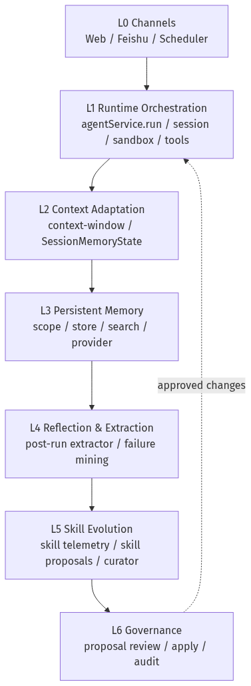

每层的核心职责：

| Layer | 名称 | 职责 | 第一阶段实现 |
| --- | --- | --- | --- |
| L0 | Channels | 把不同入口统一成一次 agent run | 已有 Web / Feishu / Scheduler |
| L1 | Runtime Orchestration | 创建/加载 session，组装工具、sandbox、prompt | 已有，新增 memory/proposal 接入 |
| L2 | Context Adaptation | 在单 session 内保持目标、决策、失败和 open items | `SessionMemoryState` |
| L3 | Persistent Memory | 跨 session 的 scoped memory 检索和写入 | `.memory/memories.jsonl` |
| L4 | Reflection & Extraction | run 后抽取候选记忆、失败经验、改进信号 | `extractMemoryCandidates` |
| L5 | Skill Evolution | 把重复流程升维成 skill proposal | `skill_create` proposal |
| L6 | Governance | 对 prompt/skill/code/tool policy 变更做人审和审计 | proposal-only |

已有的 PNG 图资产可以作为当前版本的报告图：

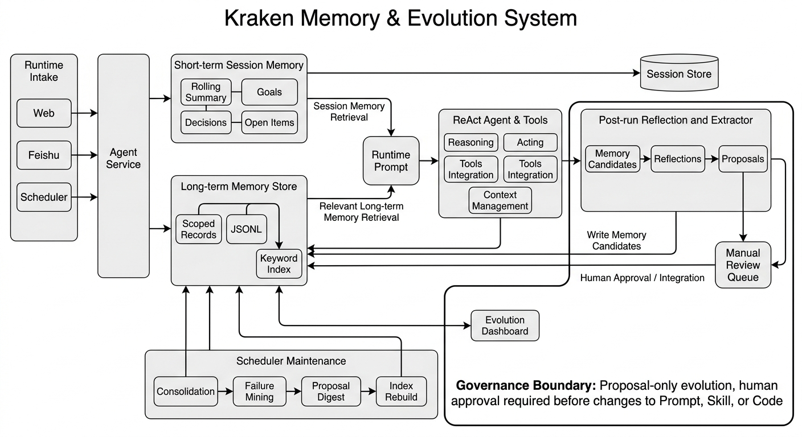

Nano Banana/OpenRouter 已生成的自进化架构图：

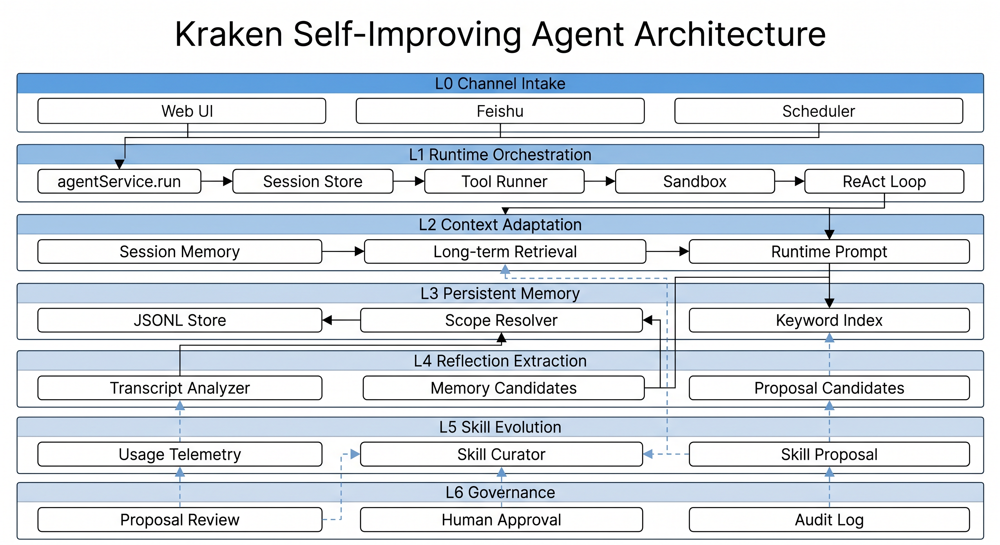

## 3. 总体架构

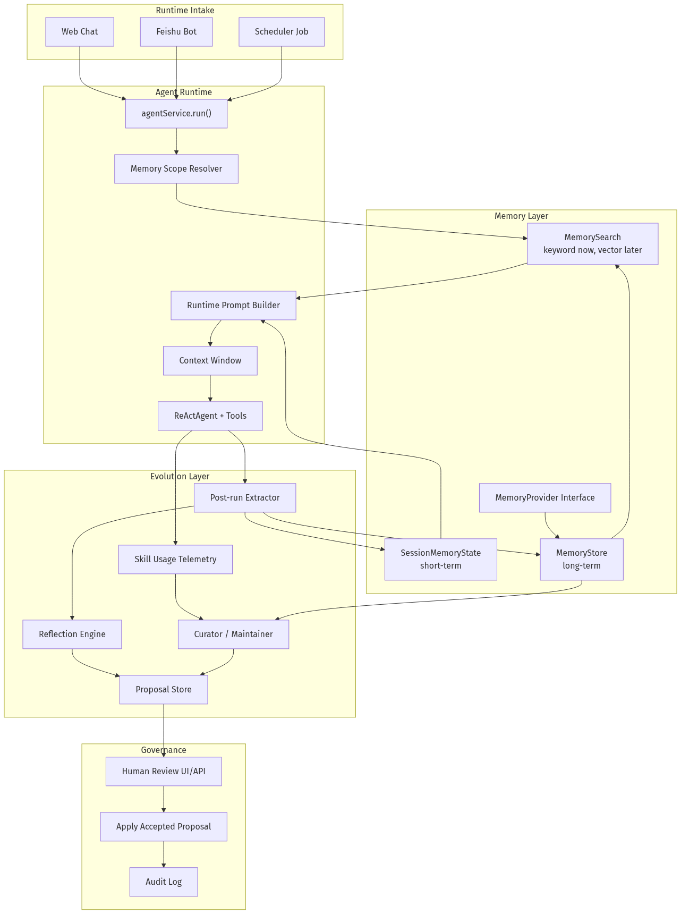

这张图里的关键点是：记忆和自进化不是额外给模型塞一个“更聪明”的提示词，而是在主运行链路前后各插入一个受控闭环。

请求前：

1. 从当前 session、sandbox、Feishu meta、scheduler job 推导 scope。
2. 读取 session memory。
3. 用用户消息检索长期 memory。
4. 组装 `<memory-context>`，注入 runtime prompt。

请求后：

1. 保存 assistant/tool 结果。
2. 更新 session memory。
3. 抽取长期 memory candidates。
4. 对失败和重复流程生成 proposal。
5. 由 curator 定期整理和升维。

## 3.1 L0 Channel Intake 层

Channel Intake 层负责把不同入口统一成同一种运行请求。它不做“学习”，只保留足够的来源信息，让后续 scope resolver 能判断记忆边界。

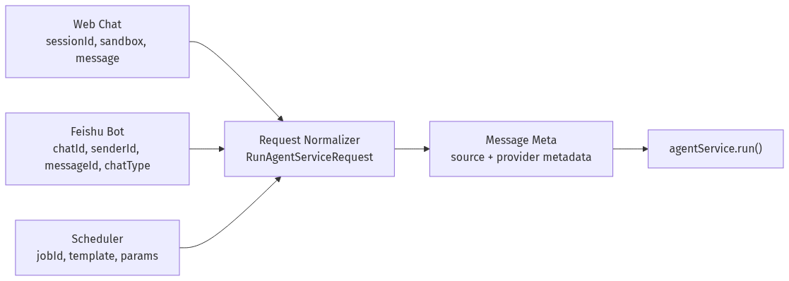

这一层的架构要求：

- Web 请求必须带上当前 `sessionId`、`sandbox`、用户消息和可选图片内容。
- Feishu 请求必须保留 `chatId`、`chatType`、`senderId`、`messageId`、`threadId`，否则长期记忆会串 scope。
- Scheduler 请求必须标记 `source='scheduler'`，后续才能将维护任务和普通用户任务分开。
- 所有入口都进入 `RunAgentServiceRequest`，避免每个入口自己实现记忆逻辑。

已经具备的基础：

- `src/runtime/agent-service.ts`
- `src/integrations/feishu/service.ts`
- `src/scheduler/service.ts`
- `src/ws/protocol.ts`

这一层的工程契约：

| 项 | 设计 |
| --- | --- |
| 输入 | 用户文本、图片附件、Feishu message meta、scheduler params、workspace/session 信息 |
| 输出 | 标准化后的 `RunAgentServiceRequest`，并附带 `source`、`channel`、`messageIds` |
| 不做的事 | 不检索长期记忆、不写 memory、不生成 proposal、不改 prompt |
| 关键不变量 | 同一条外部消息只能触发一次 run；附件必须保留 MIME、文件名、来源 ID |
| 失败处理 | 附件下载失败要进入 run meta 或 session failure，不能静默丢弃 |

图片消息支持也应该落在 L0：Web 上传的图片、Feishu 图片消息、未来的 scheduler 输入截图，最终都归一成 `content[]` 或 `attachments[]`。L1 只关心“本轮是否有可供模型读取的 image part”，不关心图片来自浏览器、Feishu 还是本地文件。

建议的数据形状：

```ts
interface AgentInputAttachment {
  id: string
  kind: 'image' | 'file'
  source: 'web' | 'feishu' | 'scheduler'
  mimeType: string
  filename?: string
  localPath?: string
  remoteId?: string
  altText?: string
}
```

L0 的验收点：

- Web 和 Feishu 传入相同图片时，L1 看到的数据结构一致。
- Feishu group 和 p2p 的 `chatType` 不能丢。
- Scheduler maintenance run 必须显式标记，避免触发递归自进化。

## 3.2 L1 Runtime Orchestration 层

Runtime Orchestration 是自进化系统的主接线层。这里不负责“判断什么值得记住”，但负责调用正确的记忆组件，并保证 prompt、tools、session 保存顺序一致。

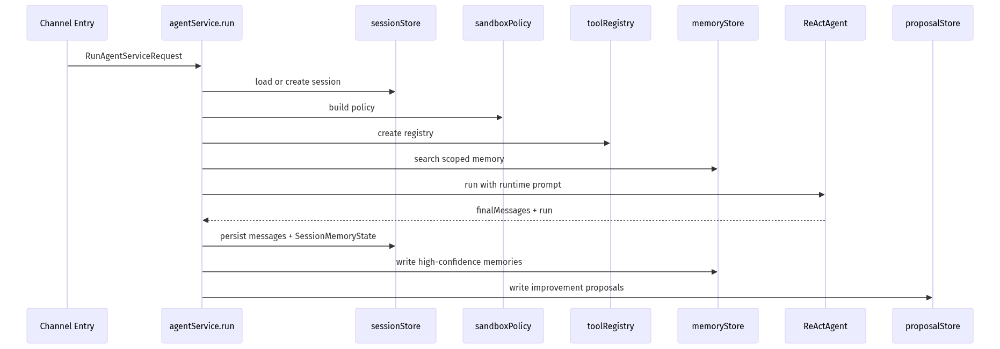

这一层的设计细节：

- `agentService.run()` 是唯一允许接入 memory sidecar 的主入口。
- `runtimeSystemPrompt` 由 base prompt、tool prompt、runtime date、sandbox context、memory context 组成。
- `memoryStore.search()` 必须发生在 `prepareContextWindow()` 之前，因为 memory prompt 会占 token budget。
- `postRunExtractor` 必须发生在 `run.sessionId` 回填之后，否则长期 memory 缺 source。
- `proposalStore` 只写 pending proposal，不应用改动。

当前 MVP 已经实现：

- `memoryEnabled`
- `memoryStore`
- `proposalStore`
- scoped memory retrieval
- memory prompt injection
- post-run extraction
- proposal generation

这一层的内部结构可以拆成 6 个步骤：


每一步的边界：

| 步骤 | 输入 | 输出 | 注意 |
| --- | --- | --- | --- |
| load session | `sessionId`、workspace | `SessionRecord` | 需要兼容旧 session 没有 `memory` 字段 |
| build policy | sandbox、channel、tools | tool registry/context | memory tools 和 file/shell tools 共享同一 run context |
| retrieve memory | scope、query、session memory | `MemorySearchResult[]` | 检索失败不应阻断用户请求 |
| build prompt | base prompt、memory、runtime meta | `runtimeSystemPrompt` | memory 块必须标记为 recalled context |
| run agent | prompt、messages、tools、attachments | assistant/tool messages | 图片 part 应随用户消息进入模型，不进入 memory |
| persist/extract | run result、tool executions | session、memory、proposal | 写入顺序是 session first，memory/proposal second |

L1 的失败模式：

- memory store 读失败：降级为空 memory，并记录 `recentFailures`。
- extractor 失败：不影响 final reply，只写 server log。
- proposal store 失败：不重跑 agent，避免重复工具调用。
- 图片附件加载失败：本轮继续执行，但 session memory 记录附件失败，后续可重试。

对应 PNG 图：

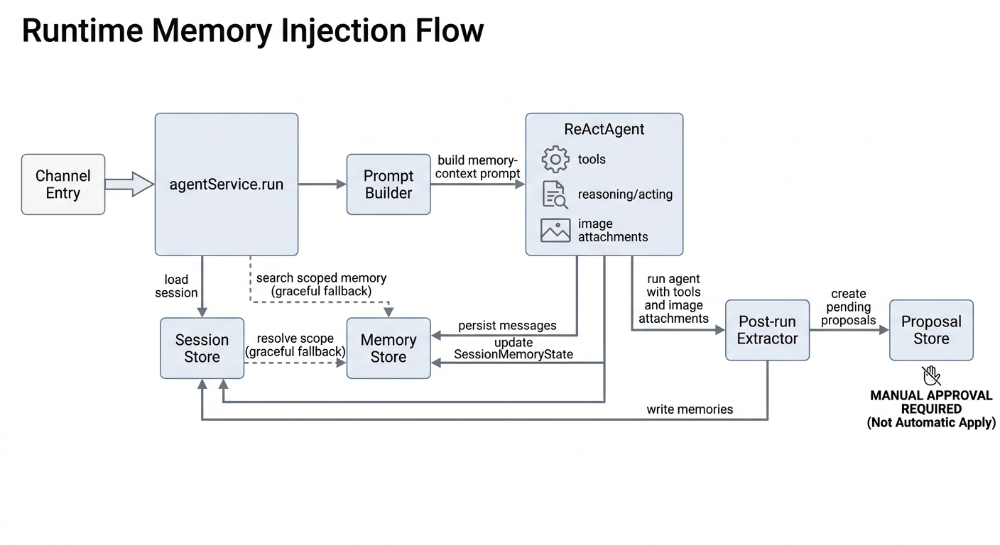

## 3.3 L2 Context Adaptation 层

Context Adaptation 对应 Hermes 的 in-conversation adaptation。它解决的是“当前任务不中断”，不是“长期知识库”。

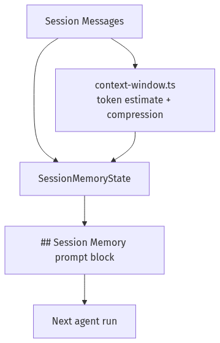

`SessionMemoryState` 的职责拆分：

| 字段 | 含义 | 来源 | 注入策略 |
| --- | --- | --- | --- |
| `summary` | 当前 session 的短摘要 | 用户消息、assistant 回复、压缩摘要 | 每轮注入，限制长度 |
| `goals` | 当前用户想完成什么 | 用户消息 | 最多保留最近/最重要 8 条 |
| `decisions` | 已经做过的技术决策 | assistant 回复、用户确认 | 只保留事实性决策 |
| `openItems` | 未完成事项 | todo/next/pending 模式 | 不应自动当作长期事实 |
| `userPreferences` | 本 session 内偏好 | 用户显式表达 | 可成为长期 memory candidate |
| `relevantFiles` | 本轮涉及路径 | 文本/工具结果 | 用于后续检索 |
| `recentFailures` | 最近工具失败 | tool executions | 用于避免重复踩坑 |

这一层的更新策略应该保守：

- 可由 deterministic extractor 更新。
- LLM 摘要可以后续加入，但不应阻塞主 run。
- 长期记忆检索不到时，session memory 仍应可用。
- 不把 session memory 当作外部事实，只当作当前会话状态。

L2 的架构重点是“短、准、可覆盖”。它不追求保存完整历史，而是给下一轮 run 一个稳定的工作台：

| 子模块 | 职责 | 当前实现方向 |
| --- | --- | --- |
| `short-term.ts` | 从消息和工具执行中更新短期状态 | deterministic update |
| `context-window.ts` | 控制上下文长度 | 压缩历史消息 |
| `prompt.ts` | 渲染 session memory block | 限制条数和长度 |
| session store | 持久化 `SessionRecord.memory` | JSON session 文件 |

Session memory 的写入规则：

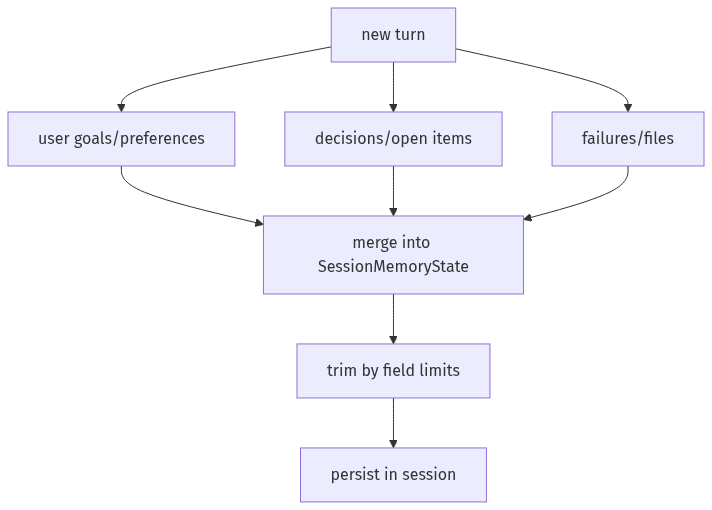

L2 的验收点：

- 长对话压缩后，目标、已确认决策、最近失败仍然存在。
- 用户说“不要改技术文档”后，当前 session 后续 run 能看到这个约束。
- 工具失败被记录，但成功后的旧失败可以标记 resolved 或被挤出窗口。

## 3.4 L3 Persistent Memory 层

Persistent Memory 对应 Hermes 的 cross-session knowledge。它的关键不是“存更多”，而是“按正确 scope 存和取”。

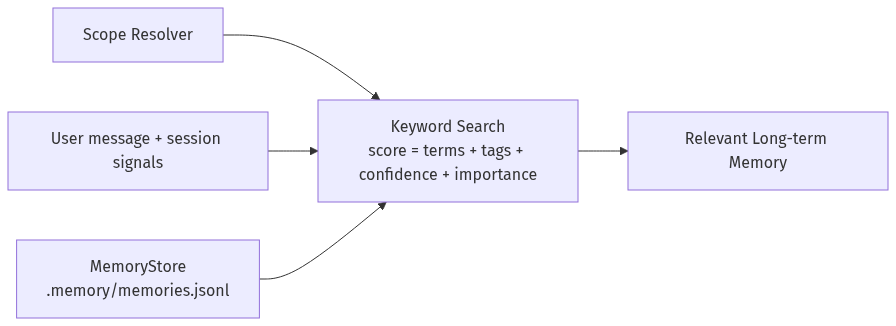

Memory record 的最小结构：

```ts
interface MemoryRecord {
  id: string
  scope: MemoryScope
  kind: 'preference' | 'fact' | 'decision' | 'procedure' | 'failure' | 'todo' | 'artifact'
  text: string
  tags: string[]
  sourceSessionId?: string
  sourceMessageIds?: string[]
  sourceRunId?: string
  confidence: number
  importance: number
  createdAt: string
  updatedAt: string
  lastUsedAt?: string
}
```

Scope 是长期记忆的安全边界：

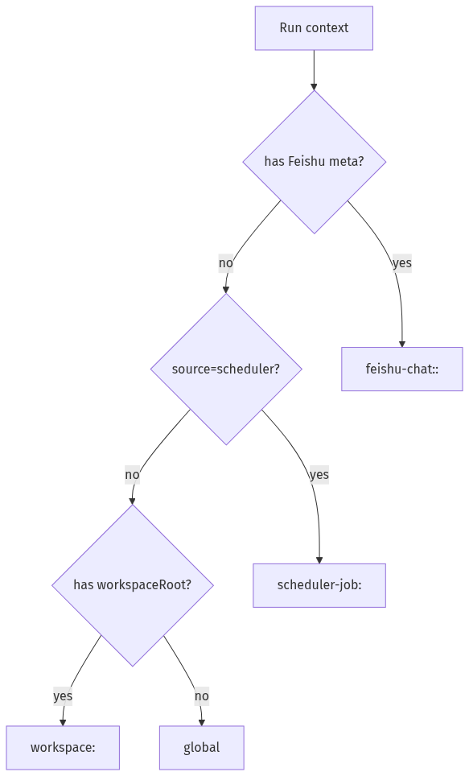

第一阶段用 JSONL 是合理的：

- 和 `.sessions`、`.scheduled-jobs` 的文件持久化路线一致。
- 容易审计，便于人工查看和回滚。
- 可以后续在 `search.ts` 后替换成 SQLite FTS5 或 embedding，不影响上层接口。

后续升级路径：

1. JSONL + keyword search。
2. SQLite + FTS5，支持 CJK trigram。
3. Embedding index，只替换 search provider。
4. 多 provider：local、remote profile、team memory。

L3 应该抽象成 provider，而不是让 runtime 直接读 JSONL：

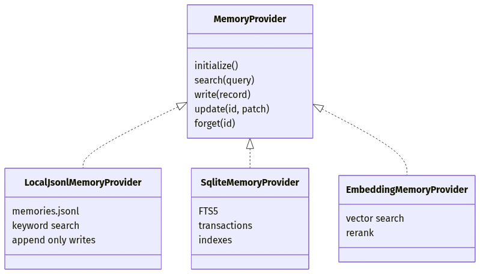

推荐的检索排序：

| 因子 | 作用 |
| --- | --- |
| scope match | 不同 workspace/Feishu chat 默认不可互相召回 |
| keyword overlap | MVP 的主排序信号 |
| kind boost | `preference`、`procedure`、`failure` 对 runtime 更有价值 |
| confidence | 低置信只在显式搜索时出现 |
| importance | 用户显式“记住”高于模型推断 |
| recency | 新近失败比很久以前的失败更重要 |

L3 的失败模式：

- JSONL 行损坏：跳过该行并写 repair proposal，不让整个 store 不可读。
- 记忆冲突：不直接覆盖，生成 `memory_merge` 或 `memory_update` proposal。
- scope 缺失：默认只读 session memory，不写长期 memory。

对应 PNG 图：

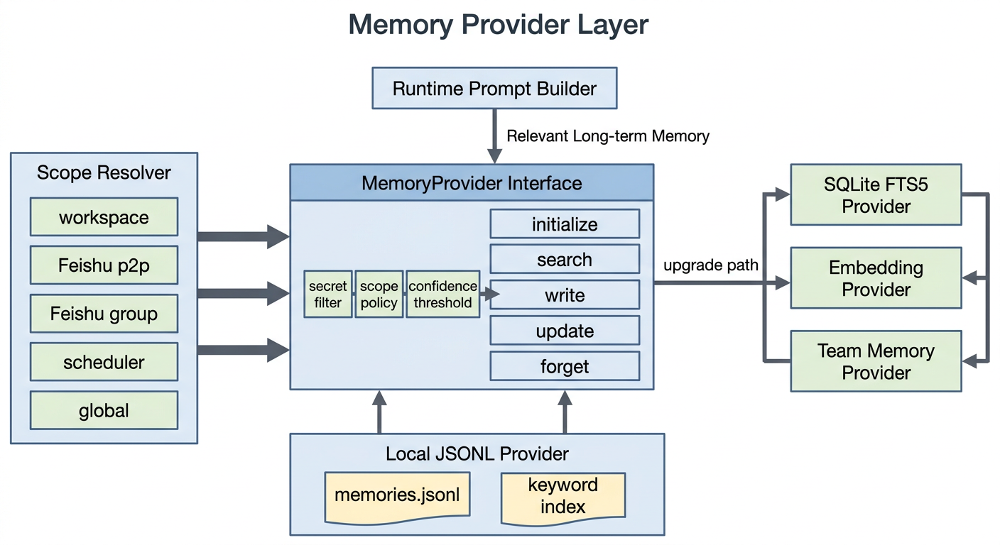

## 3.5 L4 Reflection & Extraction 层

Reflection 层在 run 后工作。它不影响当前回复速度的关键路径，可以先同步执行，后续挪到队列。

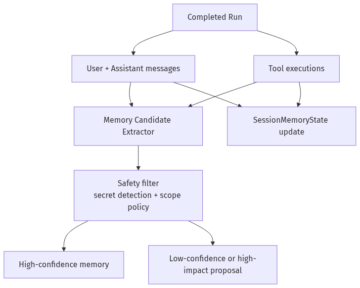

抽取规则建议：

| 信号 | 输出 |
| --- | --- |
| 用户说“记住/以后/偏好/不要” | `preference` memory |
| assistant 多次给出相同 workflow | `procedure` memory 或 `skill_create` proposal |
| tool error | `failure` memory + `code_followup` proposal |
| 明确文件路径 | `artifact` memory |
| 用户纠正模型 | `decision` 或 `failure` memory |

安全过滤必须在写 store 前执行：

- API key、token、cookie、private key 一律不写入。
- Feishu 私聊不写入 global。
- 群聊成员个人偏好不写成 group fact。
- 低置信模型推断不写 memory，只写 proposal。

L4 的双通道设计：

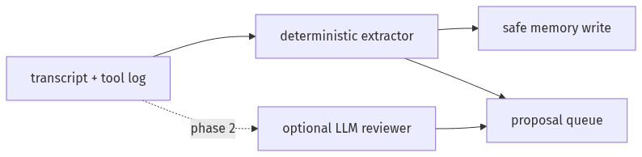

第一阶段优先 deterministic，因为它更容易审计：

| 抽取器 | 能处理 | 不处理 |
| --- | --- | --- |
| explicit preference | “记住”“以后都”“不要再” | 模糊情绪推断 |
| failure miner | tool error、build failure、permission timeout | 成功路径评价 |
| artifact miner | 修改过的文件、生成的报告、图片路径 | 任意 URL 抽取 |
| workflow miner | 重复的命令/步骤 | 自动生成 skill 文件 |

L4 的验收点：

- 文本里出现密钥形态时，不写入 `.memory/memories.jsonl`。
- extractor 只能写 candidate，不能绕过 scope/safety 直接落盘。
- 同一个 run 失败重放时不会生成大量重复 proposal。

## 3.6 L5 Skill Evolution 层

Skill Evolution 是 Hermes 最强的能力，但也是 Kraken 风险最高的能力。Kraken 的第一阶段应该只生成 skill proposal。

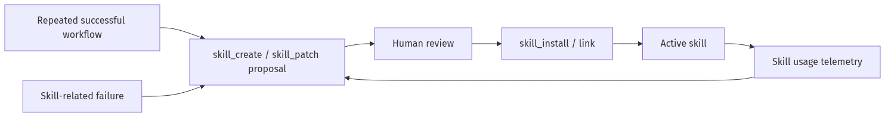

这一层需要三类数据：

1. 使用遥测：哪个 skill 被激活、读了哪些 reference、是否失败。
2. 运行结果：该 skill 相关任务是否成功。
3. 用户反馈：用户是否纠正了流程或要求“下次就这么做”。

建议先新增 `.kraken-usage.json`：

```json
{
  "name": "feishu-message-media",
  "origin": "installed",
  "useCount": 12,
  "viewCount": 34,
  "patchProposalCount": 2,
  "lastUsedAt": "2026-05-13T10:00:00.000Z",
  "state": "active",
  "pinned": false
}
```

Curator 可以基于这些数据做三件事：

- 发现重复窄技能，建议合并成 umbrella skill。
- 发现过时技能，建议 archive。
- 发现高频失败技能，建议 patch。

Skill evolution 的分层：

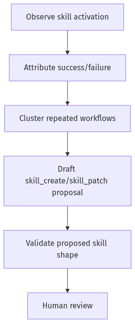

proposal 里不要只写“建议创建 skill”，而要带最小可审查草案：

```ts
interface SkillProposalPayload {
  skillName: string
  rationale: string
  triggerExamples: string[]
  proposedSkillMarkdown: string
  referencedFiles: string[]
  validationPlan: string[]
}
```

L5 的验收点：

- 高频成功 workflow 只生成 proposal，不直接写 `skills/<name>/SKILL.md`。
- skill patch proposal 必须引用失败 run 和原 skill 文件。
- 被 pin 的 skill 不会被 curator 自动 archive。

## 3.7 L6 Governance 层

Governance 是 Kraken 和 Hermes 最大的差异。Hermes 更偏个人 agent，可以更积极自改；Kraken 连接 Feishu、shell、文件写入和 skill install，因此必须 proposal-only。

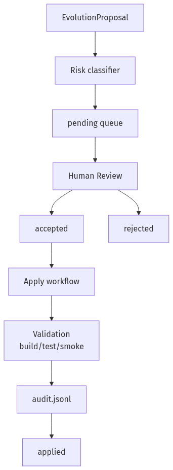

不同 proposal 的应用策略：

| Proposal | 风险 | 是否可自动应用 |
| --- | --- | --- |
| `memory_write` | low/medium | 用户明确“记住”时可直接写，其他需要确认 |
| `memory_merge` | low | deterministic merge 可自动 |
| `prompt_patch` | high | 不自动 |
| `skill_create` | medium/high | 不自动 |
| `skill_patch` | medium/high | 不自动 |
| `tool_policy` | high | 不自动 |
| `doc_update` | low/medium | 可生成 patch，但要确认 |
| `code_followup` | high | 只生成 TODO/issue，不自动改代码 |

审计要求：

- 记录 proposal 来源 run/session/message。
- 记录谁接受/拒绝。
- 记录应用前后的 diff 或 patch。
- 记录验证命令和结果。
- 支持 revert 或至少保留恢复说明。

L6 的应用链路应该和“生成 proposal”完全解耦：

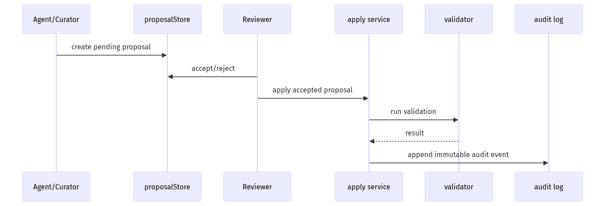

治理层的最小 API：

| API | 行为 |
| --- | --- |
| `GET /api/evolution/proposals` | 列出 pending/accepted/rejected/applied |
| `POST /api/evolution/proposals/:id/accept` | 只改状态，不应用 |
| `POST /api/evolution/proposals/:id/reject` | 记录拒绝原因 |
| `POST /api/evolution/proposals/:id/apply` | 执行受控 apply + validation + audit |

L6 的验收点：

- `prompt_patch`、`skill_patch`、`tool_policy` 不存在静默应用路径。
- apply 前后能看到 diff 或结构化变更。
- build/test/smoke 失败时 proposal 保持 accepted 但不标记 applied。

## 4. 三层进化循环

### 4.1 第一层：对话内适应

目标是让当前任务不中断、不遗忘，不依赖模型在长上下文里自己“记住一切”。

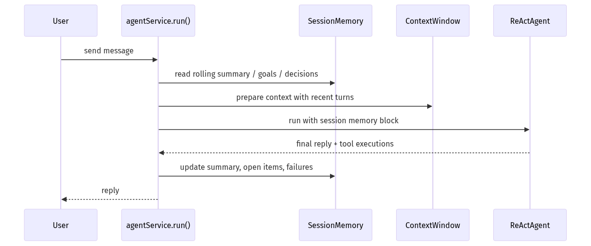

建议新增到 `SessionRecord`：

```ts
interface SessionMemoryState {
  summary: string
  goals: string[]
  decisions: string[]
  openItems: string[]
  userPreferences: string[]
  relevantFiles: string[]
  recentFailures: Array<{
    toolName: string
    inputPreview: string
    error: string
    resolved?: boolean
  }>
  updatedAt: string
}
```

实现位置：

- `src/runtime/session-store.ts`: 持久化 `memory`
- `src/memory/short-term.ts`: 更新 rolling summary
- `src/memory/prompt.ts`: 渲染 `## Session Memory`
- `src/runtime/agent-service.ts`: 在 runtime prompt 中注入

第一阶段可以用 deterministic extractor，不必每轮都调用 LLM：

- 用户消息和最终回复提取 title/open items
- tool error 写入 `recentFailures`
- `context-window.ts` 的压缩摘要进入 `summary`

### 4.2 第二层：跨会话知识沉淀

长期记忆解决“这个项目/用户/Feishu 群/定时任务以前学到过什么”。

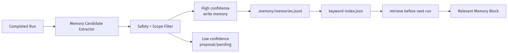

推荐第一阶段目录：

```text
.memory/
├── memories.jsonl
├── reflections.jsonl
├── proposals.jsonl
├── audit.jsonl
├── indexes/
│   └── keyword-index.json
└── runs/
    └── <runId>.json
```

`MemoryProvider` 参考 Hermes 的可插拔模型，但先只实现本地 provider：

```ts
interface MemoryProvider {
  initialize(input: { memoryDir: string }): Promise<void>
  prefetch(input: MemoryQuery): Promise<MemoryRecord[]>
  syncTurn(input: CompletedTurn): Promise<MemoryCandidate[]>
  onSessionEnd(input: SessionRecord): Promise<void>
  onMemoryWrite(record: MemoryRecord): Promise<void>
}
```

默认 scope 规则：

| 入口 | Scope |
| --- | --- |
| Web + workspaceRoot | `workspace:<root>` |
| Web without workspace | `global`，但默认不自动写 |
| Feishu p2p | `feishu:p2p:<chatId>` + optional `user:<senderId>` |
| Feishu group | `feishu:group:<chatId>` |
| Scheduler | `scheduler-job:<jobId>` + workspace |
| Skill | `skill:<name>`，只放流程知识 |

### 4.3 第三层：技能进化

Kraken 已有 skill system，适合承载“流程级长期记忆”。但技能比 memory 更强，因为它会直接影响未来行为，所以必须更严格。

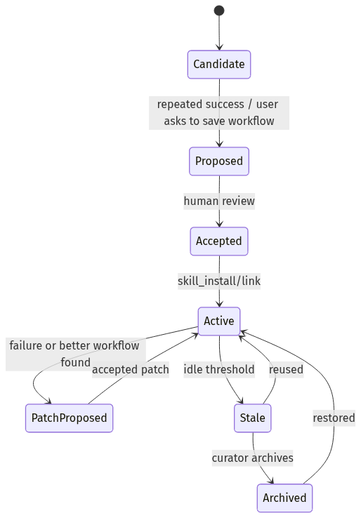

建议给 skill 增加使用遥测文件：

```text
<skill-dir>/.kraken-usage.json
```

```ts
interface SkillUsageRecord {
  name: string
  origin: 'bundled' | 'local' | 'installed' | 'agent_proposed'
  useCount: number
  viewCount: number
  patchProposalCount: number
  lastUsedAt?: string
  lastViewedAt?: string
  state: 'active' | 'stale' | 'archived'
  pinned: boolean
}
```

采集点：

- `src/tools/skill.ts`
  - `activate`: `viewCount += 1`
  - `read_reference`: `viewCount += 1`
- `src/tools/skill-install.ts`
  - install/link/init/validate 记录来源
- `src/memory/extractor.ts`
  - 当某个 workflow 重复成功，生成 `skill_create` proposal
  - 当某个 skill 关联失败，生成 `skill_patch` proposal

## 5. Curator 后台策展人

Curator 是 Hermes 架构里最值得借鉴的部分。Kraken 版本应先做“整理与建议”，不要自动修改。

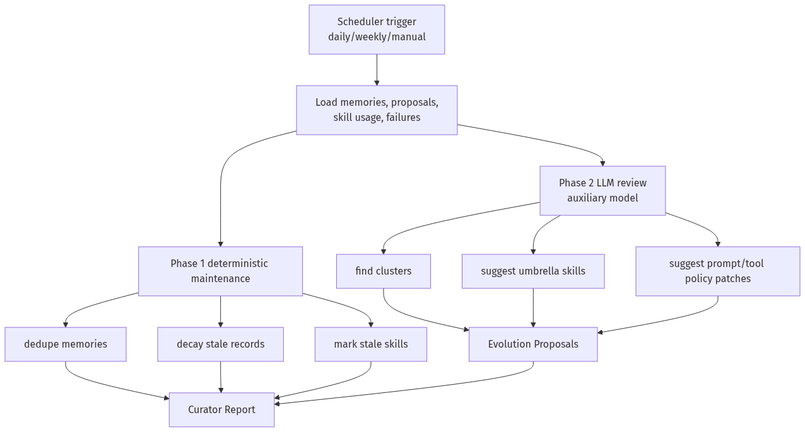

Curator 输入：

- `.memory/memories.jsonl`
- `.memory/reflections.jsonl`
- `.memory/proposals.jsonl`
- skill usage telemetry
- scheduler execution failures
- `logs/model.jsonl` 的 request/response/error 摘要

Curator 输出：

- `.memory/curator/<timestamp>/REPORT.md`
- `.memory/curator/<timestamp>/run.json`
- 新增或更新 `EvolutionProposal`

Curator 必须禁用递归自进化：

- 不加载长期记忆
- 不触发 post-run extractor
- 不自动安装 skill
- 不执行 shell/file write，除非运行 deterministic maintenance
- 使用低权限辅助模型

## 6. Proposal-Only 治理

所有会改变未来行为的动作都进入 proposal。

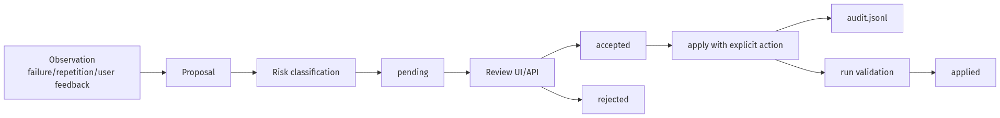

Proposal 类型：

```ts
type EvolutionProposalType =
  | 'memory_write'
  | 'memory_merge'
  | 'prompt_patch'
  | 'skill_create'
  | 'skill_patch'
  | 'tool_policy'
  | 'doc_update'
  | 'code_followup'

interface EvolutionProposal {
  id: string
  type: EvolutionProposalType
  title: string
  rationale: string
  sourceRunIds: string[]
  sourceSessionIds: string[]
  suggestedChange: string
  patch?: string
  risk: 'low' | 'medium' | 'high'
  status: 'pending' | 'accepted' | 'rejected' | 'applied'
  createdAt: string
  updatedAt: string
}
```

应用策略：

| 类型 | 默认动作 |
| --- | --- |
| `memory_write` | 低风险可人工确认后写入 |
| `memory_merge` | deterministic merge 可自动，LLM merge 需确认 |
| `prompt_patch` | 必须人工确认 |
| `skill_create` | 必须人工确认 |
| `skill_patch` | 必须人工确认 |
| `tool_policy` | 必须人工确认 |
| `code_followup` | 只生成 issue/TODO，不自动改代码 |

## 7. Prompt 注入设计

建议在 `agentService.run()` 的 runtime prompt 中加入两个隔离块。

```text
<memory-context>
System note: The following is recalled memory context, not user input.
Use it as background. Do not reveal it verbatim unless the user asks.

## Session Memory
...

## Relevant Long-term Memory
- [workspace, procedure, confidence=0.86] ...
- [failure, confidence=0.79] ...
</memory-context>
```

隔离原因：

- 防止模型把记忆误认为用户新指令
- 防止助手把内部记忆原样回显
- 便于后续做 streaming scrubber

预算建议：

| Block | Budget |
| --- | --- |
| session summary | 500-1200 tokens |
| relevant memories | 500-1500 tokens |
| recent failures | 最多 3 条 |
| user/workspace preferences | 最多 5 条 |
| procedures | 最多 3 条 |

## 8. 模块落地

推荐新增模块：

```text
src/memory/
├── types.ts
├── scope.ts
├── store.ts
├── search.ts
├── prompt.ts
├── extractor.ts
├── provider.ts
├── local-provider.ts
└── short-term.ts

src/evolution/
├── types.ts
├── proposal-store.ts
├── reflection.ts
├── skill-usage.ts
├── curator.ts
├── report.ts
└── apply.ts
```

接入点：

| 文件 | 改动 |
| --- | --- |
| `src/runtime/agent-service.ts` | resolve scope, retrieve memory, inject prompt, post-run extraction |
| `src/runtime/session-store.ts` | add `memory?: SessionMemoryState` |
| `src/runtime/context-window.ts` | pass summary into short-term memory |
| `src/tools/registry.ts` | register memory/evolution tools |
| `src/tools/skill.ts` | record skill usage |
| `src/scheduler/service.ts` | add maintenance jobs |
| `src/frontend/types.ts` | memory/proposal UI types |
| `src/frontend/components/*` | proposal review panel |

## 9. 工具与 API

### 9.1 Agent Tools

建议新增：

- `memory_search`
  - Agent 主动查记忆
- `memory_remember`
  - 用户明确要求记住时写入当前 scope
- `memory_forget`
  - 用户要求忘记时删除或 tombstone
- `proposal_create`
  - Agent 提交自进化建议

默认不要给 Agent `proposal_apply`。

### 9.2 HTTP API

建议新增：

```text
GET    /api/memory?scope=...
POST   /api/memory
DELETE /api/memory/:id

GET    /api/evolution/proposals
POST   /api/evolution/proposals/:id/accept
POST   /api/evolution/proposals/:id/reject
POST   /api/evolution/proposals/:id/apply

GET    /api/evolution/curator/runs
POST   /api/evolution/curator/run
```

### 9.3 Frontend

新增一个 `Evolution` tab：

- Pending proposals
- Memory records
- Curator reports
- Skill usage
- Apply validation result

## 10. 安全边界

必须内置的规则：

- 不保存 API key、cookie、access token、私钥。
- 不把 Feishu p2p 记忆注入 group。
- 不把 group 某个成员偏好写成 group 事实。
- 低置信推断写 proposal，不写 memory。
- 记忆必须带 source run/session/message。
- 所有 proposal apply 都写 audit log。
- Curator 不允许递归调用自进化工具。
- 自动维护最多 archive，不 delete。

敏感内容过滤建议：

```ts
const SECRET_PATTERNS = [
  /sk-[a-z0-9_-]{20,}/i,
  /sk-or-v1-[a-z0-9]{40,}/i,
  /AKIA[0-9A-Z]{16}/,
  /-----BEGIN [A-Z ]+PRIVATE KEY-----/,
  /xox[baprs]-[a-z0-9-]+/i,
]
```

## 11. 分阶段实现

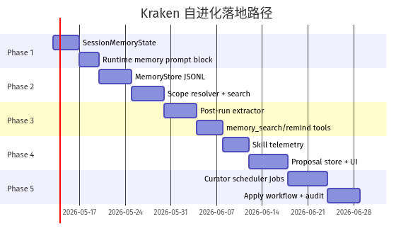

### Phase 1: Session Memory

最小改动：

- `SessionRecord.memory`
- `short-term.ts`
- `memoryPromptBlock`
- run 后更新 summary/open items/failures

验收：

- 长 session 压缩后仍能继续当前任务。
- session JSON 能看到结构化 memory。

### Phase 2: Long-term Memory

最小改动：

- `.memory/memories.jsonl`
- `MemoryStore`
- `scope.ts`
- `search.ts`
- prompt 注入 top K records

验收：

- 同 workspace 的不同 session 能复用项目事实。
- Feishu p2p/group 记忆隔离。

### Phase 3: Extraction + Tools

最小改动：

- post-run extractor
- `memory_search`
- `memory_remember`
- 敏感内容过滤

验收：

- 用户说“记住”后跨 session 生效。
- 密钥不会被写入 memory。

### Phase 4: Skill Evolution Proposal

最小改动：

- skill usage telemetry
- `skill_create` / `skill_patch` proposal
- proposal list API

验收：

- 重复 workflow 生成 skill proposal。
- skill 失败后生成 patch proposal。
- 不会自动改 skill 文件。

### Phase 5: Curator

最小改动：

- scheduler maintenance job
- deterministic dedupe/decay
- LLM review 生成 report/proposals
- apply + audit

验收：

- 每次 curator run 有机器可读和人类可读报告。
- stale memories/skills 被标记，不被删除。
- proposal apply 后可追溯。

## 12. 最小可行版本

如果只想先让系统“开始自进化”，建议只做下面 6 件事：

1. `SessionMemoryState`
2. `.memory/memories.jsonl`
3. `MemoryScopeResolver`
4. `memoryPromptBlock`
5. `postRunExtractor`
6. `EvolutionProposalStore`

先不要做：

- embedding
- SQLite
- 自动 patch prompt/skill/code
- 多 provider
- 复杂前端 dashboard

这个版本已经能形成闭环：


## 13. 与当前项目状态的关系

当前 Kraken 已经具备这些基础：

- `agentService.run()` 是统一执行入口。
- `.sessions` 已保存完整消息和 meta。
- `context-window.ts` 已有压缩状态。
- scheduler 已能触发后台 agent run。
- skill system 已支持安装、激活、持久化。
- Feishu adapter 已能记录 message meta。

因此 self-improving 不需要重写 agent runtime。正确做法是在现有主链路旁边加一个低权限 evolution sidecar：

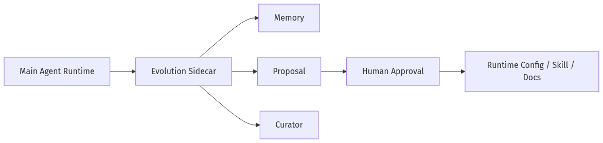

这也是和 Hermes 最接近、同时适合 Kraken 当前安全边界的路径。

## 14. 当前 MVP 实现状态

当前仓库已经落地了一个最小 self-improving 闭环：

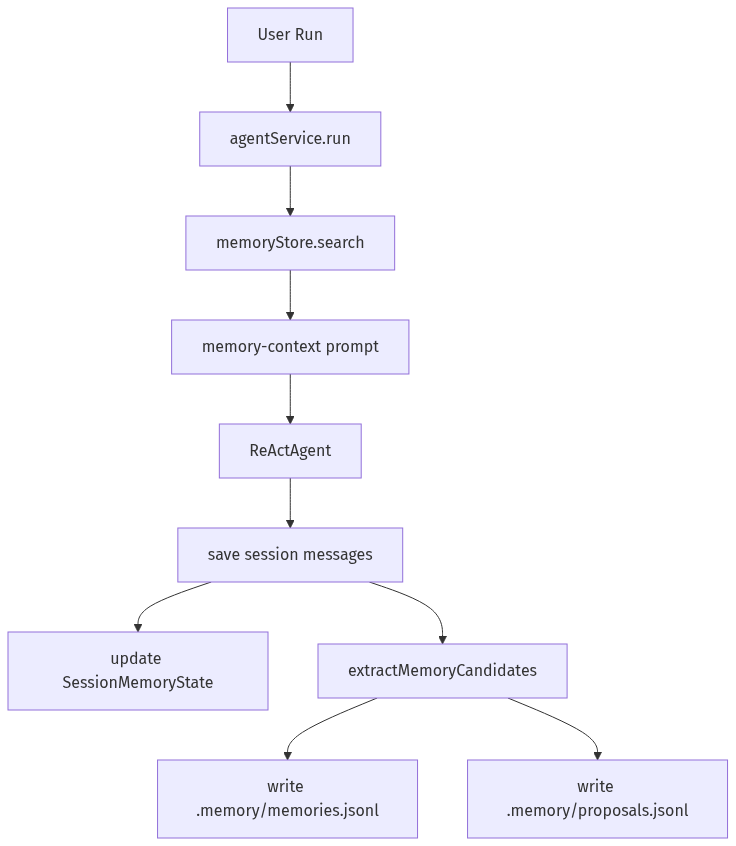

已实现文件：

| 模块 | 文件 |
| --- | --- |
| Memory types | `src/memory/types.ts` |
| Scope resolver | `src/memory/scope.ts` |
| JSONL store | `src/memory/store.ts` |
| Prompt block | `src/memory/prompt.ts` |
| Session memory | `src/memory/short-term.ts` |
| Extractor | `src/memory/extractor.ts` |
| Proposal types/store | `src/evolution/types.ts`, `src/evolution/proposal-store.ts` |
| Post-run reflection | `src/evolution/reflection.ts` |
| Agent tools | `src/tools/memory.ts` |
| Runtime integration | `src/runtime/agent-service.ts` |
| API integration | `src/server.ts` |

已提供工具：

- `memory_search`
- `memory_remember`
- `proposal_create`

已提供 API：

- `GET /api/memory`
- `GET /api/evolution/proposals`

当前 MVP 还没有做：

- Evolution 前端面板
- proposal accept/reject/apply API
- curator scheduler job
- skill usage telemetry
- SQLite/FTS5/embedding
- streaming memory scrubber

## 15. 图资产状态

本文原有的 Mermaid 架构图已经全部渲染成 PNG，并替换为图片引用。源 Mermaid 内容保存在 `docs/images/mermaid/*.mmd`，对应 PNG 保存在 `docs/images/mermaid/*.png`。

Mermaid PNG 状态：

- 已生成 25 张。
- 文档正文已不再依赖 Mermaid 代码块。
- 重新生成命令：

```bash
node skills/nano-banana-pro/scripts/render_doc_mermaid.js --replace --skip-existing
```

Nano Banana/OpenRouter 额外视觉图状态：

| 图片 | 目标文件 | 内容 |
| --- | --- | --- |
| 总体架构 | `docs/images/kraken-self-improving-overview.png` | 已生成，L0-L6 分层和主数据流 |
| Runtime 运行链路 | `docs/images/kraken-runtime-memory-injection.png` | 已生成，`agentService.run()` 如何检索、注入、保存 |
| Memory Provider | `docs/images/kraken-memory-provider-layer.png` | 已生成，scope、store、search、provider |
| Reflection Pipeline | `docs/images/kraken-reflection-extraction.png` | 未生成，已有 Mermaid PNG 替代 |
| Skill Evolution | `docs/images/kraken-skill-evolution-curator.png` | 未生成，已有 Mermaid PNG 替代 |
| Governance | `docs/images/kraken-proposal-governance.png` | 未生成，已有 Mermaid PNG 替代 |

已生成 Nano Banana/OpenRouter 图：

- `kraken-self-improving-overview.png`: 2K
- `kraken-runtime-memory-injection.png`: 1K
- `kraken-memory-provider-layer.png`: 1K

如果需要补齐剩余 3 张 Nano Banana/OpenRouter 视觉图，补充 OpenRouter 额度后运行：

```bash
node skills/nano-banana-pro/scripts/generate_self_improving_diagrams.js \
  --only reflection,skill,governance \
  --resolution 1K \
  --output-dir docs/images \
  --proxy http://127.0.0.1:7897
```

生成命令模板：

```bash
node skills/nano-banana-pro/scripts/generate_image.js \
  --prompt "<diagram prompt>" \
  --filename "kraken-self-improving-overview.png" \
  --output-dir "docs/images" \
  --resolution 2K \
  --proxy "http://127.0.0.1:7897"
```

推荐 prompt：

### 15.1 总体架构图

目标文件：`docs/images/kraken-self-improving-overview.png`

```text
Create a clean technical architecture diagram for a software design document.
Title: Kraken Self-Improving Agent Architecture.
White background, crisp vector-like engineering diagram, readable English labels.
Show seven horizontal layers stacked top-to-bottom:
L0 Channel Intake: Web UI, Feishu, Scheduler.
L1 Runtime Orchestration: agentService.run, Session Store, Tool Runner, Sandbox, ReAct Loop.
L2 Context Adaptation: Session Memory, Long-term Retrieval, Runtime Prompt.
L3 Persistent Memory: JSONL Store, Scope Resolver, Keyword Index.
L4 Reflection Extraction: Transcript Analyzer, Memory Candidates, Proposal Candidates.
L5 Skill Evolution: Usage Telemetry, Skill Curator, Skill Proposal.
L6 Governance: Proposal Review, Human Approval, Audit Log.
Use arrows showing runtime flow downward and learning feedback upward.
Minimal colors, no gradients, no logos, no watermark, avoid tiny text.
```

### 15.2 Runtime 运行链路图

目标文件：`docs/images/kraken-runtime-memory-injection.png`

```text
Create a clean software sequence diagram as a polished architecture image.
Title: Runtime Memory Injection Flow.
White background, readable English labels, engineering document style.
Participants left to right: Channel Entry, agentService.run, sessionStore, MemoryStore, Prompt Builder, ReActAgent, ProposalStore.
Show steps:
1 load or create session.
2 resolve scope from workspace and Feishu metadata.
3 search scoped memory.
4 build memory-context prompt.
5 run ReActAgent with tools and image attachments.
6 persist messages and SessionMemoryState.
7 extract memory candidates.
8 write memories and pending proposals.
Highlight that retrieval failure degrades gracefully and proposal apply is not automatic.
No decorative gradients, no logos, no watermark, avoid tiny text.
```

### 15.3 Memory Provider 图

目标文件：`docs/images/kraken-memory-provider-layer.png`

```text
Create a clean technical architecture diagram.
Title: Memory Provider Layer.
White background, crisp boxes and arrows, readable English labels.
Center: MemoryProvider Interface with methods initialize, search, write, update, forget.
Left: Scope Resolver with workspace, Feishu p2p, Feishu group, scheduler, global.
Bottom: Local JSONL Provider with memories.jsonl and keyword index.
Right upgrade path: SQLite FTS5 Provider, Embedding Provider, Team Memory Provider.
Top: Runtime Prompt Builder receives Relevant Long-term Memory.
Show safety gates before write: secret filter, scope policy, confidence threshold.
Use restrained colors, no logos, no watermark, avoid tiny text.
```

### 15.4 Reflection Pipeline 图

目标文件：`docs/images/kraken-reflection-extraction.png`

```text
Create a clean pipeline diagram for an agent self-improvement system.
Title: Post-run Reflection and Extraction.
White background, engineering style, readable English labels.
Left inputs: Completed Run, User Messages, Assistant Messages, Tool Executions, Attachments.
Pipeline: Deterministic Extractor, Optional LLM Reviewer, Safety Filter, Deduplicator.
Outputs split into three lanes:
SessionMemoryState update, High-confidence Memory Records, Pending Evolution Proposals.
Add warning boundary: no API keys, no private chat leakage, low confidence becomes proposal.
Show that this pipeline runs after final reply and should not block user response.
No decorative gradients, no logos, no watermark, avoid tiny text.
```

### 15.5 Skill Evolution Curator 图

目标文件：`docs/images/kraken-skill-evolution-curator.png`

```text
Create a clean architecture diagram.
Title: Skill Evolution and Curator.
White background, readable English labels, crisp vector-like style.
Show cycle: Skill Activation, Usage Telemetry, Success or Failure Attribution, Workflow Clustering, Skill Proposal Draft, Human Review, Skill Install or Patch.
Include curator side lane: Daily Scheduler loads memories, proposals, skill usage, failures; then dedupe, stale detection, umbrella skill suggestion, report generation.
Show governance boundary: curator can propose but cannot silently modify skills.
Use concise text, restrained colors, no logos, no watermark, avoid tiny text.
```

### 15.6 Governance 图

目标文件：`docs/images/kraken-proposal-governance.png`

```text
Create a clean state machine and workflow diagram.
Title: Proposal-only Governance.
White background, readable English labels, technical document style.
Main states: pending, accepted, rejected, applied.
Flow: Agent or Curator creates proposal, Risk Classifier, Human Review, Accept or Reject, Apply Service, Validation, Audit Log.
Show proposal types and risk levels in a compact side panel: memory_write low, memory_merge low, prompt_patch high, skill_patch high, tool_policy high, code_followup high.
Emphasize: accepted does not mean applied; validation failure keeps proposal unapplied.
No decorative gradients, no logos, no watermark, avoid tiny text.
```

注意：

- API key 从 `.env` 读取，不要写入文档。
- 图中不要出现 token、secret、真实用户 ID 或真实 Feishu chat ID。
- 图中文字尽量短，因为图片模型的小字稳定性不如 Mermaid。
- 若作为长期技术文档，Mermaid 应保留为权威版本，PNG 作为视觉辅助。
